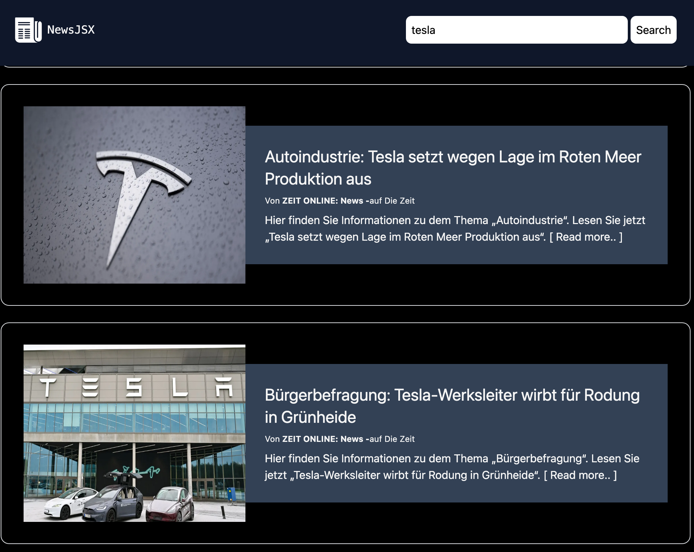

# NewsJSX

> ## Web View




How to get started?

> 1. Create an account @NewsApi 

> 2. Download the project

> 3. Install the dependencies

    ```js
        npm install
    ```

> 4. create a .env file with a variable called VITE_API_KEY=<'Your Api Key goes here without brackets quotes etc.'>

> 5. run the project with:

    ```js
        npm run dev
    ```

> 6. Enjoy 🍫